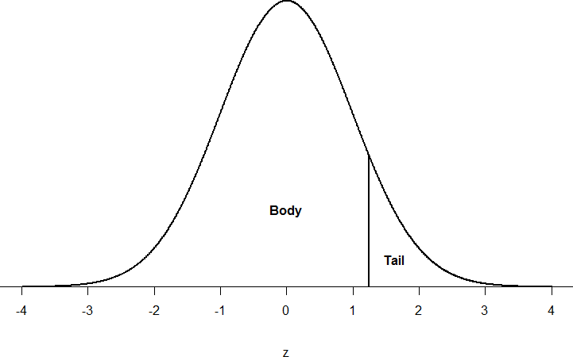
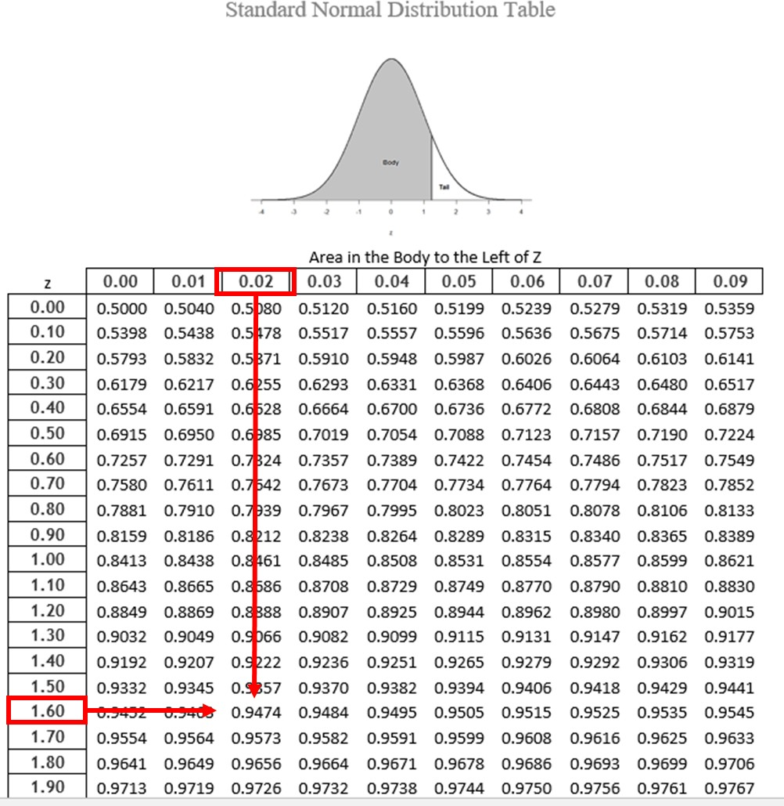
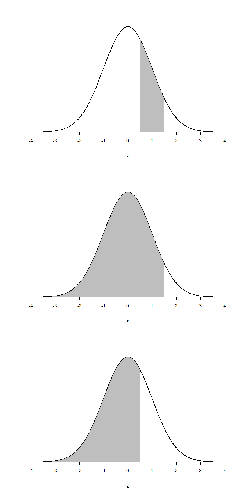
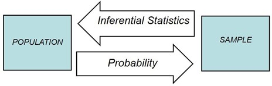

# (PART) Module 06 {-}

```{r include = FALSE}
source("code/common.R")

# install.packages("devtools")

if (!require("tweetrmd"))  devtools::install_github("gadenbuie/tweetrmd")
library(tweetrmd) #... embedding tweets
class_urls <- read.csv("./data/class_urls.csv")
```

```{r links, child="admin/md/links.md"}
```

# Welcome to Probability

As we transition from descriptive to inferential statistics, we begin our exploration of probability - the foundation of statistical inference. Probability provides the direct link between samples and the populations they represent. In this chapter, we'll focus on the fundamental concepts needed to lay the groundwork for future inferential statistics, connecting probability to our existing knowledge of normal distributions and z-scores.

```{r,echo=FALSE}
knitr::include_graphics("https://imgs.xkcd.com/comics/probability.png")
```

Why do we care about probability? Well, besides helping you calculate your odds of winning the lottery (spoiler alert: they're not good), probability is essential for understanding how likely our statistical results are to occur by chance. It's like the bouncer at the club of statistical significance - deciding what gets in and what doesn't.

## Basic Probability Concepts

Informally, we usually think of **probability** as a number that describes the likelihood of some event occurring, which ranges from zero (impossibility) to one (certainty). But probability isn't always about precise numbers - sometimes it's more like a weather forecast for your data.

```{r}
library(ggplot2)
# labels
terms_data <- data.frame(
  term = c("Impossible", "Almost Impossible", "Very Unlikely", "Unlikely", "50-50 chance", "Likely", "Very Likely", "Almost Certain", "Absolute Certain"),
  value = c(0, 0.01, 0.1, 0.25, 0.5, 0.75, 0.9, 0.99, 1),
  anchor = c(T, F, F, F, T, F, F, F, T)
) %>% arrange(value)
# Set the factor levels according to the order of 'value'
terms_data$term <- factor(terms_data$term, levels = terms_data$term[order(terms_data$value)])

terms_data %>% filter(anchor==T)%>%
ggplot(aes(x = value, y = term)) +
  geom_point(aes(color = anchor), size = 3) +
  geom_segment(aes(xend = value, yend = term), 
               x = 0, xend = 1, linetype = "dashed") +
  scale_color_manual(values = c("red", "black")) +
  geom_text(aes(label = term), hjust = .5, vjust = -.5)+
  theme_minimal() +
  theme(
    axis.title = element_blank(),
    axis.text = element_blank(),
    axis.ticks = element_blank(),
    legend.position = "none"
  ) +
  labs(title = "Probability Terminology") +
  xlim(-0.1, 1.1)

```

Probability can be discussed more vaguely. "Chances are low it will rain today" is something you might hear from a meteorologist (or your weather app, if you're not fancy enough to have a personal meteorologist). But notice how the probability changes with conditions: "Given there are no clouds, chances are low it will rain today." That "given" is statistician-speak for "under these conditions."

> Fun fact: The word "given" in probability is like the statistical version of "once upon a time" in fairy tales. It sets the stage for all the probabilistic action that follows!

As conditions change, so does the probability. If it were cloudy and windy outside, we might say, "given the current weather conditions, there is a high probability that it is going to rain." It's like a game of probabilistic Jenga - change one piece, and the whole structure of likelihood shifts!

Now, you might have noticed that terms like "low" and "high" are pretty vague. They're the statistical equivalent of saying "a pinch" in a recipe - it means something different to everyone. That's why in statistics, we try to use more precise language or, even better, numbers to represent the probability of our event.

```{r}
terms_data %>%
ggplot(aes(x = value, y = term)) +
  geom_point(aes(color = anchor), size = 3) +
  geom_segment(aes(xend = value, yend = term), 
               x = 0, xend = 1, linetype = "dashed") +
  scale_color_manual(values = c("red", "black")) +
  geom_text(aes(label = term), hjust = .5, vjust = -.5)+
  theme_minimal() +
  theme(
    axis.title = element_blank(),
    axis.text = element_blank(),
    axis.ticks = element_blank(),
    legend.position = "none"
  ) +
  labs(title = "Probability Terminology") +
  xlim(-0.1, 1.1)
```

Regardless of whether we're using vague terms or precise numbers, the basic structure and logic of our probability statements remain consistent. It's like the grammar of uncertainty - once you know the rules, you can speak probability fluently!

Sometimes probabilities will instead be expressed in percentages, which range from zero to one hundred, as when the weather forecast predicts a twenty percent chance of rain today. In each case, these numbers express how likely that particular event is, ranging from absolutely impossible (0%) to absolutely certain (100%). When we speak of the probability of something happening, we are talking about how likely a "thing" will happen based on the conditions present. To formalize probability theory, we first need to define a few terms: 

### What is probability?
**Probability theory** is the branch of mathematics that deals with chance and uncertainty. It forms an important part of the foundation for statistics, because it provides us with the mathematical tools to describe uncertain events. The study of probability arose in part due to interest in understanding games of chance, like cards or dice. These games provide useful examples of many statistical concepts, because when we repeat these games the likelihood of different outcomes remains (mostly) the same.

### The Probability Formula

To calculate probability, we need an activity that produces or observes an outcome. This could be anything from flipping a coin to trying a new route to work. It is typically an experiment or any situation or activity in which the result is not known in advance. Before we dive into the formula, let's define some key terms:

- '''Sample space''': This is the set of all possible outcomes for our activity. We write it using fancy squiggly brackets { }.
  - For a coin flip: {heads, tails}
  - For a six-sided die: {1, 2, 3, 4, 5, 6}
  - For the weather: {rain, not rain}

> For the amount of time it takes to get to work, the sample space is all possible real numbers greater than zero (since it can't take a negative amount of time to get somewhere, at least not yet). We won't bother writing out all those numbers within the brackets.

- '''Outcome or event''': This is a subset of the sample space that we're interested in. It's the "what are we actually looking for?" part of our probability question. In principle, it could be one or more of possible outcomes in the sample space, but here we will focus primarily on elementary events which consist of exactly one possible outcome. An event is a catch-all term to talk about any specific thing happening.

> For example, this could be it rains, obtaining heads in a single coin flip, rolling a 4 on a throw of the die, or taking 21 minutes to get home by the new route.

In statistics, we usually define probability as the **expected relative frequency of a particular outcome**.  The **relative frequency** is the number of times an event takes place relative to the number of times it could have taken place.

Let's look at a slightly deeper example before we learn a basic probability formula. Say we have a regular, six-sided die (note that "die" is singular and "dice" is plural, a distinction that can be hard to get correct on the first try) and want to know how likely it is that we will roll a 1. That is, what is the probability of rolling a 1, given that the die is not weighted (which would introduce what we call a bias, though that is beyond the scope of this chapter). We could roll the die and see if it is a 1 or not, but that won't tell us about the probability, it will only tell us a single result. We could also roll the die hundreds or thousands of times, recording each outcome and seeing what the final list looks like, but this is time-consuming, and rolling a die that many times may lead down a dark path to gambling or, worse, playing Dungeons & Dragons. What we need is a simple equation that represents what we are looking for and what is possible.

To calculate the probability of an event, which here is defined as rolling a 1 on an unbiased die, we need to know two things: how many outcomes satisfy the criteria of our event (stated different, how many outcomes would count as what we are looking for) and the total number of outcomes possible. In our example, only a single outcome, rolling a 1, will satisfy our criteria, and there are a total of six possible outcomes (rolling a 1, rolling a 2, rolling a 3, rolling a 4, rolling a 5, and rolling a 6). Thus, the probability of rolling a 1 on an unbiased die is 1 in 6 or 1/6.

Put into an equation using generic terms, we get:

Probability = $\frac{Number of Favorable  (desired) outcomes}{Total number of possible Outcomes}$

We can also using P( ) as shorthand for probability and we can use A as shorthand for an event:

P(A) = $\frac{Number of Favorable outcomes to A}{Total number of possible Outcomes}$

Probability is usually symbolized by the letter p. The actual probability number is usually written as a decimal, though sometimes fractions or percentages are used. An event with a 50-50 chance is usually written as p = .5 but it could be written as p = 1/2 or p = 50%. It is also common to see probability written as being less than some value, using the less than (<) sign. For example, p < .05 means the probability of the event taking place is less than .05 or less than 5%.

Using the above equation, let's calculate the probability of rolling an even number on this die:

> P(even number) = 2, 4, or 6/1, 2, 3, 4, 5, or 6  =  3/6  =  .5. So we have a 50% chance of rolling an even number of this die.

Let's look at another example, let's say that we are interested in knowing the probability of rain in Phoenix. We first have to define the activity — let's say that we will look at the National Weather Service data for each day in 2020 and determine whether there was any rain at the downtown Phoenix weather station. According to these data, in 2020 there were 15 rainy days. To compute the probability of rain in Phoenix, we simply divide the number of rainy days by the number of days counted (365), giving p(rain in PHX in 2020) = 0.04.

Now that we have a probability formula, we can outline the formal features of probability (first defined by the Russian mathematician Andrei Kolmogorov). These are the features that a value has to have if it is going to be a probability.

- Probability cannot be negative.
- The total probability of all outcomes in the sample space is 1; 
    - that is, if we take the probability of each event and add them up, they must sum to 1. 
    - This is interpreted as saying "Take all of the possible events and add up their probabilities. These must sum to one."
- The probability of any individual event cannot be greater than one.     
- This is implied by the previous point; since they must sum to one, and they can't be negative, then any particular probability cannot exceed one.

To summarize, the probability that an event happens is the number of outcomes that qualify as that event (i.e. the number of ways the event could happen) compared to the total number of outcomes (i.e. how many things are possible). The principles laid out here operate under a certain set of conditions and can be elaborated into ideas that are complex yet powerful and elegant. However, such extensions are not necessary for a basic understanding of statistics, so we will end our discussion on the math of probability here. We will now return to a more familiar topic. This idea then brings us back around to our normal distribution, which can also be broken up into regions or areas, each of which are bounded by one or two z-scores and correspond to all z- scores in that region. The probability of randomly getting one of those z-scores in the specified region can then be found on a **Standard Normal Distribution Table**. Thus, the larger the region, the more likely an event is, and vice versa. Because the tails of the distribution are, by definition, smaller and we go farther out into the tail, the likelihood or probability of finding a result out in the extremes becomes small.

## Probability & Frequency Distributions

For our purposes, we will see shortly that the normal distribution is the key to how probability works. If you toss a fair coin four times, the outcomes may not be two heads and two tails. However, if you toss the same coin 4,000 times, the outcomes will be close to half heads and half tails. The expected theoretical probability of heads in any one toss is 1/2 or 0.5. Even though the outcomes of a few repetitions are uncertain, there is a regular pattern of outcomes when there are many repetitions (law of large numbers). The pattern tends to resemble a symmetrical normal distribution.

To help us think about probability, population, and inferential statistics we are going to use a frequency distribution because it can be seen as representing an entire population. This can be seen as a parallel concept because if all scores are represented in a frequency distribution it can function as a normal distribution. Using the empirical rule we know that different portions of the histogram can represent different proportions of the population and the terms proportions and probabilities mean the same thing. This means that a proportion of the histogram can correspond to the probability of a population.

## Probability in Normal Distributions

Recall that the normal distribution has an area under its curve that is equal to 1 and that it can be split into sections by drawing a line through it that corresponds to a given z-score. Because of this, we can interpret areas under the normal curve as probabilities that correspond to z-scores. In this section, we are going to link together the concepts of population, probability, and z-scores. We learned earlier that a frequency distribution can represent an entire population of scores. The shape of a frequency distribution for an entire population forms a symmetrical normal curve and certain proportions can be assigned to specific parts of the distribution.

```{r stddiag, echo=FALSE,fig.cap="Z-Score Distribution"}
# source: https://commons.wikimedia.org/wiki/File:Standard_deviation_diagram.svg
#svg(filename = "Standard deviation diagram.svg", width = 7, height = 3.5)
par(mar = c(2, 2, 0, 0))

# # External package to generate four shades of blue
 library(RColorBrewer)
 cols <- rev(brewer.pal(4, "Blues"))


# Sequence between -4 and 4 with 0.1 steps
x <- seq(-4, 4, 0.1)

# Plot an empty chart with tight axis boundaries, and axis lines on bottom and left
plot(x, type="n", xaxs="i", yaxs="i", xlim=c(-4, 4), ylim=c(0, 0.4),
     bty="l", xaxt="n", xlab="", ylab="")

# Function to plot each coloured portion of the curve, between "a" and "b" as a
# polygon; the function "dnorm" is the normal probability density function
polysection <- function(a, b, col, n=11){
    dx <- seq(a, b, length.out=n)
    polygon(c(a, dx, b), c(0, dnorm(dx), 0), col=col, border=NA)
    # draw a white vertical line on "inside" side to separate each section
    segments(a, 0, a, dnorm(a), col="white")
}

# Build the four left and right portions of this bell curve
for(i in 0:3){
    polysection(     i, i + 1, col=cols[i + 1])  # Right side of 0
    polysection(-i - 1,    -i, col=cols[i + 1])  # Left right of 0
}

# Black outline of bell curve
lines(x, dnorm(x))

# Bottom axis values, where sigma represents standard deviation and mu is the mean
axis(1, at=-3:3, labels=expression(mu - 3 * sigma, mu - 2 * sigma, mu - sigma, mu,
                                   mu + sigma, mu + 2 * sigma, mu + 3 * sigma))

# Add percent densities to each division (rounded to 1 decimal place), between x and x+1
text(c((0:3) + 0.5, (0:-3) - 0.5), c(0.16, 0.05, 0.04, 0.02),
     sprintf("%.1f%%", 100 * (pnorm(1:4) - pnorm(0:3))),
     col=c("white", "white", "black", "black"))
segments(c(-2.5, -3.5, 2.5, 3.5), dnorm(c(2.5, 3.5)),
         c(-2.5, -3.5, 2.5, 3.5), c(0.03, 0.01))

```

The graph above only shows us some of the proportions associated with specific z-score values but the Unit Normal Table lists all possible values for a normal distribution. This means that we can use z-scores to help us find the specific probability for a specific outcome or event.

First, let's look back at the area between z = -1.00 and z = 1.00 presented in the next figure.


```{r stddiag68, echo = FALSE, fig.cap="68% data come from the blue-shaded region"}
# source: https://commons.wikimedia.org/wiki/File:Standard_deviation_diagram.svg

par(mar = c(2, 2, 0, 0))
 cols <- rev(brewer.pal(4, "Blues"))
cols[2:4] <- c("#FFFFFF", "#FFFFFF", "#FFFFFF")

# Sequence between -4 and 4 with 0.1 steps
x <- seq(-4, 4, 0.1)

# Plot an empty chart with tight axis boundaries, and axis lines on bottom and left
plot(x, type="n", xaxs="i", yaxs="i", xlim=c(-4, 4), ylim=c(0, 0.4),
     bty="l", xaxt="n", xlab="", ylab="")

# Build the four left and right portions of this bell curve
for(i in 0:3){
    polysection(i,
                i + 1,
                col=cols[i + 1])  # Right side of 0
    polysection(-i - 1,
                -i,
                col=cols[i + 1])  # Left right of 0
}

# Black outline of bell curve
lines(x, dnorm(x))

# Bottom axis values, where sigma represents standard deviation and mu is the mean
axis(1, at=-3:3, labels=expression(mu - 3 * sigma, mu - 2 * sigma, mu - sigma, mu,
                                   mu + sigma, mu + 2 * sigma, mu + 3 * sigma))

# Add percent densities to each division (rounded to 1 decimal place), between x and x+1
text(c(0.05),
     c(0.16),
     sprintf("%.1f%%", -100 * (pnorm(-1) - pnorm(1))),
     col=c("white"))

#segments(c(-2.5, -3.5, 2.5, 3.5), dnorm(c(2.5, 3.5)),
#         c(-2.5, -3.5, 2.5, 3.5), c(0.03, 0.01))

```

We were told earlier that this region contains 68% of the area under the curve. Thus, if we randomly chose a z-score from all possible z-scores, there is a 68% chance that it will be between z = -1.00 and z = 1.00 because those are the z-scores that satisfy our criteria.

Just like a pie chart is broken up into slices by drawing lines through it, we can also draw a line through the normal distribution to split it into sections. Take a look at the normal distribution in Figure 3 which has a line drawn through it as z = 1.25. This line creates two sections of the distribution: the smaller section called the tail and the larger section called the body. Differentiating between the body and the tail does not depend on which side of the distribution the line is drawn. All that matters is the relative size of the pieces: bigger is always body.

```{r bodytail, fig.margin = TRUE, echo = FALSE, fig.cap="Body and tail of the normal distribution"}

```

As you can see, we can break up the normal distribution into 3 pieces (lower tail, body, and upper tail) as in Figure 2 or into 2 pieces (body and tail) as in Figure 3. We can then find the proportion of the area in the body and tail based on where the line was drawn (i.e. at what z-score). Mathematically this is done using calculus.

Fortunately, the exact values are given you to you in a *Standard Normal Distribution Table*, also known at the **z-table**. Using the values in this table, we can find the area under the normal curve in any body, tail, or combination of tails no matter which z-scores are used to define them.

The z-table presents the values for the area under the curve to the left of the positive z-scores from 0.00-3.00 (technically 3.09), as indicated by the shaded region of the distribution at the top of the table. To find the appropriate value, we first find the row corresponding to our z-score then follow it over until we get to the column that corresponds to the number in the hundredths place of our z-score. For example, suppose we want to find the area in the body for a z-score of 1.62.

We would first find the row for 1.60 then follow it across to the column labeled

> (1.60 + 0.02 = 1.62) and find 0.9474 (see Figure 4). Thus, the odds of randomly selecting someone with a z-score less than (to the left of) z = 1.62 is 94.74% because that is the proportion of the area taken up by values that satisfy our criteria.


```{r normtable, echo = FALSE, fig.cap="Using the z-table to find the area in the body to the left of z = 1.62"}

```

The z-table only presents the area in the body for positive z-scores because the normal distribution is symmetrical. Thus, the area in the body of z = 1.62 is equal to the area in the body for z = -1.62, though now the body will be the shaded area to the right of z (because the body is always larger). When in doubt, drawing out your distribution and shading the area you need to find will always help. The table also only presents the area in the body because the total area under the normal curve is always equal to 1.00, so if we need to find the area in the tail for z = 1.62, we simply find the area in the body and subtract it from 1.00 (1.00 – 0.9474 = 0.0526).

Let's look at another example. This time, let's find the area corresponding to z- scores more extreme than z = -1.96 and z = 1.96. That is, let's find the area in the tails of the distribution for values less than z = -1.96 (farther negative and therefore more extreme) and greater than z = 1.96 (farther positive and therefore more extreme). This region is illustrated in Figure 5.

```{r z196, echo = FALSE, fig.cap="Area in the tails beyond z = -1.96 and z = 1.96"}
# source: https://commons.wikimedia.org/wiki/File:Standard_deviation_diagram.svg

par(mar = c(2, 2, 0, 0))

cols <- rev(brewer.pal(4, "Blues"))
cols[1:3] <- c("#FFFFFF", "#FFFFFF", "#FFFFFF")

# Sequence between -4 and 4 with 0.1 steps
x <- seq(-4, 4, 0.1)

# Plot an empty chart with tight axis boundaries, and axis lines on bottom and left
plot(x, type="n", xaxs="i", yaxs="i", xlim=c(-4, 4), ylim=c(0, 0.4),
     bty="l", xaxt="n", xlab="", ylab="")

# Build the four left and right portions of this bell curve
for(i in 0:3){
    polysection(i,
                i + 1,
                col=cols[i + 1])  # Right side of 0
    polysection(-i - 1,
                -i,
                col=cols[i + 1])  # Left right of 0
}
i = 1.96
    polysection(i,
                4,
                col=cols[4])  # Right side of 0
    polysection(-4,
                -i,
                col=cols[4])  # Left right of 0
# Black outline of bell curve
lines(x, dnorm(x))

# Bottom axis values, where sigma represents standard deviation and mu is the mean
axis(1, at=-3:3, labels=expression(mu - 3 * sigma, 
                                   mu - 2 * sigma, 
                                   mu - sigma, 
                                   mu,
                                   mu + sigma, 
                                   mu + 2 * sigma, 
                                   mu + 3 * sigma))


```


Let's start with the tail for z = 1.96. If we go to the z-table we will find that the body to the left of z = 1.96 is equal to 0.9750. To find the area in the tail, we subtract that from 1.00 to get 0.0250. Because the normal distribution is symmetrical, the area in the tail for z = -1.96 is the exact same value, 0.0250.

Finally, to get the total area in the shaded region, we simply add the areas together to get 0.0500. Thus, there is a 5% chance of randomly getting a value more extreme than z = -1.96 or z = 1.96 (this particular value and region will become incredibly important later on).

Finally, we can find the area between two z-scores by shading and subtracting. Figure 6 shows the area between z = 0.50 and z = 1.50. Because this is a subsection of a body (rather than just a body or a tail), we must first find the larger of the two bodies, in this case the body for z = 1.50, and subtract the smaller of the two bodies, or the body for z = 0.50. Aligning the distributions vertically, as in Figure 6, makes this clearer. From the z-table, the area in the body for z = 1.50 is 0.9332 and the area in the body for z = 0.50 is 0.6915. Subtracting these gives us 0.9332 – 0.6915 = 0.2417.

```{r zclever, echo = FALSE, fig.cap=" Area between z = 0.50 and 1.50, along with the corresponding areas in the body"}

```

## Considerations in understanding probability and inferential statistics: sampling

Recall that the goal of inferential statistics is to draw conclusions or make predictions about large populations by using data from smaller samples that represent that population. Probability is the underlying concept of inferential statistics and forms a direct link between samples and the population that they come from.

```{r inf_probability, echo = FALSE, fig.cap="The relationship between inferential statistics and probability"}

```

As we learned earlier, gathering information about an entire population often costs too much or is virtually impossible. Instead, we use a sample of the population. A sample should have the same characteristics as the population it is representing. **Random sampling** is one method that may ensure representativeness of a sample. For our definition of probability to be consistent and accurate we must ensure two elements:

1. Every person in the population has an equal chance of being selected
2. Sampling occurs with replacement

For **random sampling** a researcher starts with a **complete list of the population** (sometimes referred to as a sampling frame) and randomly selects some of them to an experiment. In this way every member of the population has an equal chance of being selected to participate. In order for the total number of outcomes to remain constant we need sampling with replacement – this means as one person is selected, another person must be added to keep the total number of possible outcomes the same. This is the full definition of random sampling.

For example, if the population is 25 people, the sample is ten, and you are sampling with replacement for any particular sample, then the chance of picking the first person is ten out of 25, and the chance of picking a different second person is nine out of 25 (you replace the first person). If you sample without replacement, then the chance of picking the first person is ten out of 25, and then the chance of picking the second person (who is different) is nine out of 24 (you do not replace the first person).

Compare the fractions to four decimal places:
    - 9/25 = 0.3600
    - 9/24 = 0.3750
    
It is clear that these numbers are not equivalent. Since we are using small samples as a stand-in for large populations in a research experiment, there will always be a certain level of uncertainty in our conclusions. How do we know that calculating statistical probability gives us the right number? The answer to this question comes from the **law of large numbers**, which shows that the empirical probability will approach the true probability as the sample size increases. We can see this by simulating a large number of coin flips, and looking at our estimate of the probability of heads after each flip.

The left panel of Figure 8 shows that as the number of samples (i.e., coin flip trials) increases, the estimated probability of heads converges onto the true value of 0.5. It's unlikely that any of us has ever flipped a coin tens of thousands of times, but we are nonetheless willing to believe that the probability of flipping heads is 0.5. However, note that the estimates can be very far off from the true value when the sample sizes are small. A real-world example of this was seen in the 2017 special election for the US Senate in Alabama, which pitted the Republican Roy Moore against Democrat Doug Jones. The right panel of Figure 8 shows the relative amount of the vote reported for each of the candidates over the course of the evening, as an increasing number of ballots were counted. Early in the evening the vote counts were especially volatile, swinging from a large initial lead for Jones to a long period where Moore had the lead, until finally Jones took the lead to win the race.

```{r lawlarge, echo = FALSE, fig.cap="Left: A demonstration of the law of large numbers. A coin was flipped 30,000 times, and after each flip the probability of heads was computed based on the number of heads and tail collected up to that point. It takes about 15,000 flips for the probability to settle at the true probability of 0.5. Right: Relative proportion of the vote in the Dec 12, 2017 special election for the US Senate seat in Alabama, as a function of the percentage of precincts reporting. These data were transcribed from [here](https://www.ajc.com/news/national/alabama-senate-race-live-updates-roy-moore-doug-jones/KPRfkdaweoiXICW3FHjXqI/)"}

```


These two examples show that while large samples will ultimately converge on the true probability, the results with small samples can be far off. Unfortunately, many people forget this and overinterpret results from small samples. This was referred to as the *law of small numbers* by the psychologists Danny Kahneman and Amos Tversky, who showed that people (even trained researchers) often behave as if the law of large numbers applies even to small samples, giving too much credence to results based on small datasets. We will see examples throughout the course of just how unstable statistical results can be when they are generated on the basis of small samples. Furthermore, a very important point: even if we are able to make an accurate prediction, we can never prove with 100% certainty that this prediction will hold true in all possible situations. This is because samples never have exactly the same characteristics of the population from which they come from. Therefore, we will always have some level of uncertainty about whether the results found in our sample are also found in the population. The best we can do is infer what is most likely to be found. Our level of confidence in an inferential statistic or the outcome of an experiment is represented through probability theory.

## More Probability Terms

A **probability distribution** describes the probability of all of the possible outcomes in an activity. For example, on Jan 20 2018, the basketball player Steph Curry hit only 2 out of 4 free throws in a game against the Houston Rockets. We know that Curry's overall probability of hitting free throws across the entire season was 0.91, so it seems pretty unlikely that he would hit only 50% of his free throws in a game, but exactly how unlikely is it? We can determine this using a theoretical probability distribution; throughout this book we will encounter a number of these probability distributions, each of which is appropriate to describe different types of data. In this case, we use the binomial distribution, which provides a way to compute the probability of some number of successes out of a number of trials on which there is either success or failure and nothing in between (only 2 outcomes), given some known probability of success on each trial. In this example, if we calculated the probability of Curry making 2 of 4 free throws when his season average was .91, it would come out to a 4% chance^[The fine print calculating Steph Curry's free throws probability: P(2;4,0.91)=(42)0.912(1−0.91)4−2=0.040 ].  This shows that given Curry's overall free throw percentage, it is very unlikely that he would hit only 2 out of 4 free throws. This just goes to show that unlikely things do actually happen in the real world.

Often though, we might want to know how likely it is to find a value that is as extreme or more than a particular value versus a specific value; this will become very important when we discuss hypothesis testing later. To answer this question, we can use a **cumulative probability distribution**; whereas a standard probability distribution tells us the probability of some specific value, the cumulative distribution tells us the probability of a value as large or larger (or as small or smaller) than some specific value.  For the Curry free-throw example, this would be .043^[Fine print: To determine this, we could use the binomial probability equation and plug in all of the possible values of outcomes and add them together: P(k≤2)=P(k=2)+P(k=1)+P(k=0)=6e−5+.002+.040=.043 P(k\le2)= P(k=2) + P(k=1) + P(k=0) = 6e^{-5} + .002 + .040 = .043].  In many cases the number of possible outcomes would be too large for us to compute the cumulative probability by enumerating all possible values; fortunately, it can be computed directly for any theoretical probability distribution.

Although we have information, sometimes we can be mislead.  Let's use the example of a coin toss. Each toss is independent of one another with only 2 outcomes {heads, tails}. What if I want to calculate the probability of getting heads for a coin toss? I might base that on my previous 12 coin flips. A coin might come up heads 8 times out of 12 flips, for a relative frequency of 8/12 or 2/3. Again, the probability is usually calculated as the proportion of successful outcomes divided by the number of all possible outcomes. What happens if I toss the coin again? What is the probability that it will be heads again? Do I use information from my previous 12 flips? Well, the answer is ½ or 50%. That is because in our scenario, each toss is independent and each outcome is independent. This means that the outcome of the ninth toss is not related to the previous toss. To assume otherwise is committing what we call **gambler's fallacy**.

### Statistical Independence

The term "independent" has a very specific meaning in statistics, which is somewhat different from the common usage of the term. **Statistical independence** between two variables means that knowing the value of one variable doesn't tell us anything about the value of the other. This can be expressed as: P(A|B)=P(A). That is, the probability of A given some value of B is just the same as the overall probability of A (because they are independent). Again, while independence in common language often refers to sets that are exclusive, statistical independence refers to the case where one cannot predict anything about one variable from the value of another variable. For example, knowing a person's hair color is unlikely to tell you whether they prefer chocolate or strawberry ice cream. Later in the book we will discuss statistical tools that will let us directly test whether two variables are independent.

Sometimes we want to quantify the relation between probabilities more directly, which we can do by converting them into odds which express the relative likelihood of something happening or not. We can use odds to compare different probabilities, by computing what is called an **odds ratio** – which is exactly what it sounds like. For example, let's say that we want to know how much the positive test increases the individual's odds of having cancer. We can first compute the prior odds – that is, the odds before we knew that the person had tested positively. An odds ratio is an example of what we will later call an effect size, which is a way of quantifying how relatively large any particular statistical effect is.

A final point relates to how probabilities have been interpreted. Historically, there have been two different ways that probabilities have been interpreted. The first (known as the frequentist interpretation) interprets probabilities in terms of long-run frequencies. For example, in the case of a coin flip, it would reflect the relative frequencies of heads in the long run after a large number of flips. While this interpretation might make sense for events that can be repeated many times like a coin flip, it makes less sense for events that will only happen once, like an individual person's life or a particular presidential election; and as the economist John Maynard Keynes famously said, "In the long run, we are all dead." The other interpretation of probabilities (known as the Bayesian interpretation) is as a degree of belief in a particular proposition. If I were to ask you "How likely is it that the US will return to the moon by 2040", you can provide an answer to this question based on your knowledge and beliefs, even though there are no relevant frequencies to compute a frequentist probability. One way that we often frame subjective probabilities is in terms of one's willingness to accept a particular gamble. For example, if you think that the probability of the US landing on the moon by 2040 is 0.1 (i.e. odds of 9 to 1), then that means that you should be willing to accept a gamble that would pay off with anything more than 9 to 1 odds if the event occurs. As we will see, these two different definitions of probability are very relevant to the two different ways that statisticians think about testing statistical hypotheses, which we will encounter in later chapters.

## Recap

Probability is a mathematical tool used to study randomness. It deals with the chance (the likelihood) of an event occurring. The theory of probability began with the study of games of chance such as poker. Predictions take the form of probabilities. To predict the likelihood of an earthquake, of rain, or whether you will get an A in this course, we use probabilities. Doctors use probability to determine the chance of a vaccination causing the disease the vaccination is supposed to prevent. A stockbroker uses probability to determine the rate of return on a client's investments. You might use probability to decide to buy a lottery ticket or not. In your study of statistics, you will use the power of mathematics through probability calculations to analyze and interpret your data.

### Learning objectives

Having read this chapter, you should be able to:

Describe the sample space for a selected random experiment.
Describe the law of large numbers.
Describe the difference between a probability and a conditional probability
Describe the relationship between z-scores and the standard unit normal table (z-table)
Probability is a tough topic for everyone, but the tools it gives us are incredibly powerful and enable us to do amazing things with data analysis. They are the heart of how inferential statistics work.

### Exercises

1. In your own words, what is probability?
2. There is a bag with 5 red blocks, 2 yellow blocks, and 4 blue blocks. If you reach in and grab one block without looking, what is the probability it is red?
3. Under a normal distribution, which of the following is more likely? (Note: this question can be answered without any calculations if you draw out the distributions and shade properly)
    - Getting a z-score greater than z = 2.75
    - Getting a z-score less than z = -1.50
4. The heights of women in the United States are normally distributed with a mean of 63.7 inches and a standard deviation of 2.7 inches. If you randomly select a woman in the United States, what is the probability that she will be between 65 and 67 inches tall?
5. The heights of men in the United States are normally distributed with a mean of 69.1 inches and a standard deviation of 2.9 inches. 6. What proportion of men are taller than 6 feet (72 inches)?
6. You know you need to score at least 82 points on the final exam to pass your class. After the final, you find out that the average score on the exam was 78 with a standard deviation of 7. How likely is it that you pass the class?
7. What proportion of the area under the normal curve is greater than z = 1.65?
8. Find the z-score that bounds 25% of the lower tail of the distribution.
9. Find the z-score that bounds the top 9% of the distribution.
10. In a distribution with a mean of 70 and standard deviation of 12, what proportion of scores are lower than 55?
